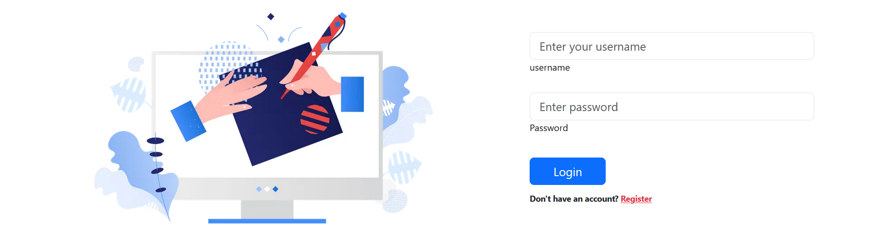
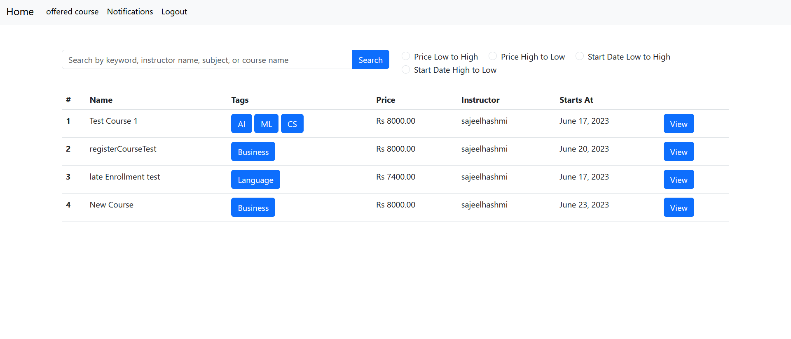
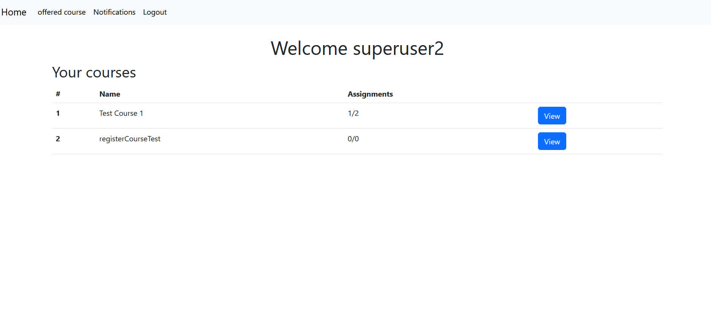
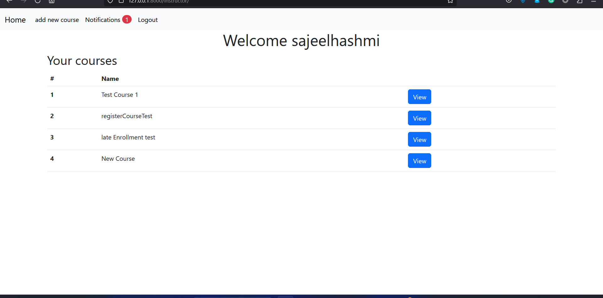
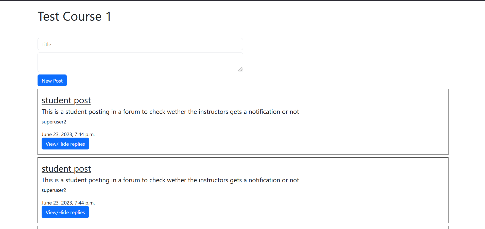

# Online learning platform
This is an online learning platform built-in Django it has the following apps and functionality
#### 1 Signup:
    This app handles the signup and login process for students and instructors a student can 
    signup or login  but an instructor can only login to create a new instructor you have to 
    go to the Django admin area
    

#### 2 Explore Courses:
    Explore Courses and use various filters to get the required data

 

#### 3 Student Dashboard:
    The student dashboard app handles everything student related whether it be registering for 
    new courses,  uploading assignment submissions, viewing assessments on submissions and 
    browsing for courses 
 

#### 4 Instructors Dashboard:

    The Instructor's dashboard app handles everything instructor-related, whether registering 
    for courses,  uploading assignments, viewing submissions, or marking assessments.
    

#### 5 Forums:
    Each course has a forum where students and instructors can post. This app handles everything 
    forum-related like a new post, replies to posts, and authentication on whether a forum is 
    accessible by a person, i.e. he/she is registered in that course or not.
    

#### 6 Notifications:
    This notification app contains the notification model that is embedded through out the whole 
    of the project, it also contains a view to mark the notification as read.
    

